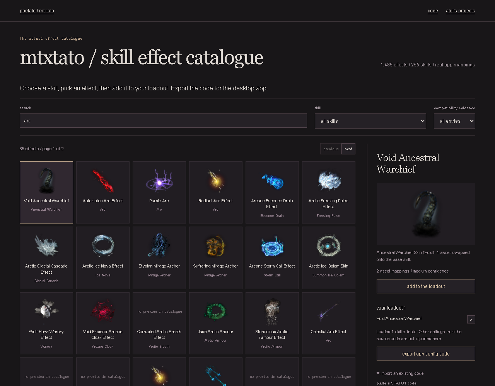

# smoothtato

One Path of Exile visual tool: remove unwanted graphics and add cosmetic effects through reusable game-file replacement presets.

**[graphics editor](https://lolstar123.github.io/smoothtato-preview/)** ? **[cosmetics catalogue](https://lolstar123.github.io/smoothtato-preview/cosmetics/)** ? [desktop app](https://poetato.app)

## Two parts, one tool

- **Graphics:** 68 actual settings, five presets, searchable switches, and STATO1 import/export.
- **Cosmetics:** 1,489 skill-effect records, 1,107 preview icons, compatibility checks, saved loadouts and STATO1 import/export.

Use the graphics/cosmetics tabs to switch between the working browser demos. The desktop app applies the file replacements. These browser editors export their respective configuration fields separately; they do not merge unrelated fields from an imported code.




## Code map

| Part | Source |
| --- | --- |
| Graphics editor and codec | [examples/portfolio](examples/portfolio) |
| Cosmetics catalogue and codec | [examples/portfolio/cosmetics](examples/portfolio/cosmetics) |
| Data provenance | [PROVENANCE.md](PROVENANCE.md) |
| Browser checks | [tools](tools) |

## Run

```sh
python -m http.server 8000 --directory examples/portfolio
node --test examples/portfolio/model.test.mjs examples/portfolio/cosmetics/model.test.mjs
python tools/browser_audit.py
python tools/cosmetics_audit.py
```

No account or API key is needed. Bundled preview artwork retains its original ownership.
