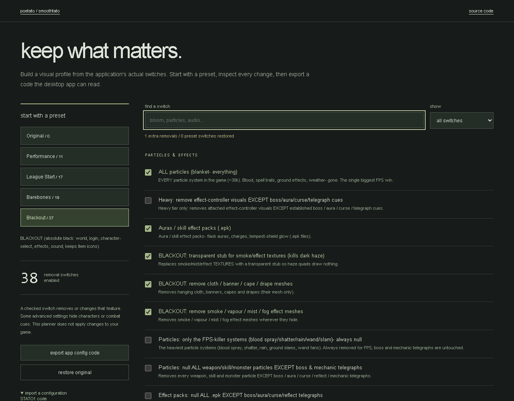

# smoothtato

A Path of Exile visual-settings planner using the desktop app's actual categories and presets.

**[Open the live editor](https://lolstar123.github.io/smoothtato-preview/)** | [poetato.app](https://poetato.app)

Choose Performance, League Start, Barebones or Blackout. Change individual switches, compare your changes against the preset, and export a STATO1 code the desktop app can read. Original clears every removal switch. Your choices stay in this browser between visits.



## What is here

- 68 categories and five presets extracted from the actual engine.
- Search, grouping and filters for enabled or modified settings.
- Raw and compressed desktop-code import; preset-relative export with checksum.
- Disabled controls for source categories marked broken or not implemented.

This is a configuration editor. It does not patch game files or claim measured FPS improvements. Some aggressive switches hide characters, effects or sound; read each switch before exporting. Imported skin and other advanced fields are not retained by this visual-settings editor.

## Run and check

```sh
python -m http.server 8000 --directory examples/portfolio
node --test examples/portfolio/model.test.mjs
pip install playwright
python -m playwright install chromium
python tools/browser_audit.py
```

Open http://localhost:8000. No account or API key required. GitHub Actions runs these checks, publishes the app and checks the public page every four hours.

The [model](examples/portfolio/model.mjs), [UI](examples/portfolio/app.mjs), [catalogue](examples/portfolio/data/settings.json) and [provenance](PROVENANCE.md) are separate and small enough to inspect directly.
