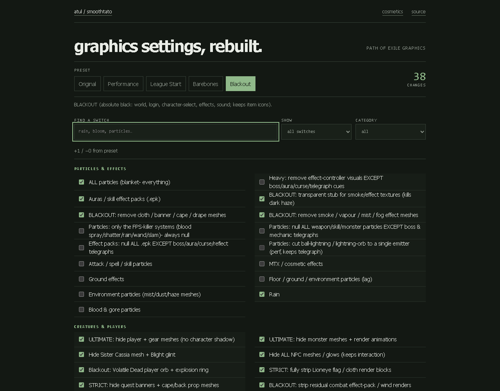
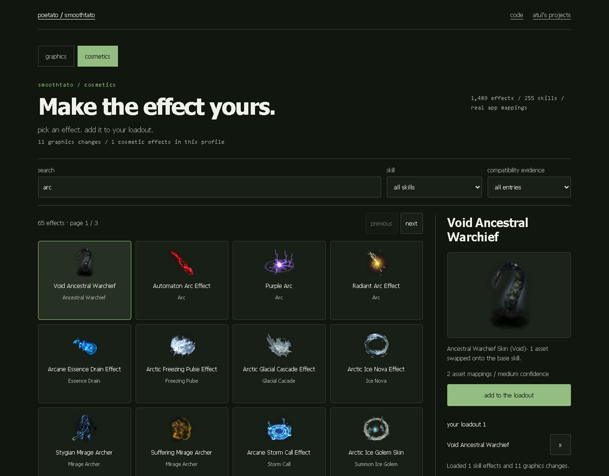

# Smoothtato

A Path of Exile graphics and cosmetics editor with one reusable profile.

[**Open graphics**](https://lolstar123.github.io/smoothtato-preview/) ? [**Open cosmetics**](https://lolstar123.github.io/smoothtato-preview/cosmetics/) ? [Desktop app](https://poetato.app)

Choose which graphics categories to remove, build a cosmetic-effect loadout, and export both in a single **STATO1** code. The browser plans the profile; the desktop application applies game-file replacements.




## Graphics

The editor contains **68 source settings and five actual presets**. Start with Performance, compare its illustrated encounter with Original, then search for a specific setting or browse one category. The default switch list contains only the active changes rather than all 68 settings. The **my changes** filter shows deviations from the selected preset.

Checked switches apply the named change. Categories marked unavailable remain visible for source completeness but cannot be enabled through their switches. Restoring Original resets graphics and keeps the cosmetic loadout.

The encounter is a CSS illustration of twelve visual groups. It is not game footage, an exact preview of every switch, or a measured FPS result. Settings also cover audio and meshes that the sketch does not represent.

## Cosmetics

The actual catalogue has **1,489 effect records across 255 skills**, with **1,107 bundled preview icons**. Entries without artwork show that explicitly. Search by effect or skill, filter compatibility evidence, inspect asset mappings, and add an effect to the loadout.

Selecting another effect for the same skill replaces the prior choice. Effects targeting the same base asset with different replacements block export. Catalogue confidence is evidence from the app's mapping data, not a guarantee for every game version.

Desktop pages show 24 effects. On phones, eight compact rows and pagination above and below the list keep the catalogue manageable. Selecting an effect moves keyboard focus to its details; **back to effects** returns to the selected row.

## One profile

Graphics and cosmetics share browser-local selections on the same origin. Either editor exports both halves in the desktop-compatible STATO1 field order, including preset-relative graphics additions/removals and cosmetic keys. Codes can be imported from either page.

An import is validated before either half changes. Corrupt codes, unknown categories, unmapped effects, duplicate skill selections, conflicting replacements and unsupported extra fields are rejected with the current profile intact. Browser storage is local to that browser and origin; it does not sync to an account or another device.

## Run locally

Use Python 3 and a current browser with `DecompressionStream` support for compressed desktop codes. There is no frontend package install or build step.

```sh
python -m http.server 8000 --directory examples/portfolio
```

Open **http://localhost:8000** and use the graphics/cosmetics tabs. Serve the whole `examples/portfolio` directory so the two pages can load their shared configuration logic.

## Checks

```sh
node --test examples/portfolio/model.test.mjs examples/portfolio/cosmetics/model.test.mjs examples/portfolio/profile.test.mjs
python -m pip install playwright
python -m playwright install chromium
python tools/browser_audit.py
python tools/cosmetics_audit.py
```

The Node tests check actual presets, raw and compressed codes, corruption, replacement conflicts and matching combined exports from both editors. Headless browser checks cover custom switches, focus retention, Original comparison, reduced motion, filtering, real images, imports, shared-profile navigation, exports, error states and 390 px layouts. On Windows they use installed Google Chrome; other platforms use Playwright Chromium. Evidence is saved in ignored `output/qa/`, alongside refreshed README previews.

## Code map

| File | Responsibility |
| --- | --- |
| [Graphics app](examples/portfolio/app.mjs) | Presets, switch list and illustrative scene |
| [Graphics model](examples/portfolio/model.mjs) | Preset deltas and STATO1 codec |
| [Shared profile](examples/portfolio/profile.mjs) | Browser storage and imported-effect validation |
| [Cosmetics app](examples/portfolio/cosmetics/app.mjs) | Catalogue, inspection, loadout and combined export |
| [Cosmetics model](examples/portfolio/cosmetics/model.mjs) | Per-skill selection and asset conflicts |
| [PROVENANCE.md](PROVENANCE.md) | Source settings, catalogue and artwork ownership |
| [DESIGN.md](DESIGN.md) | Unified layout, controls and verification criteria |

No account, API key or game process is needed. Preview artwork retains its original ownership, including Grinding Gear Games.
